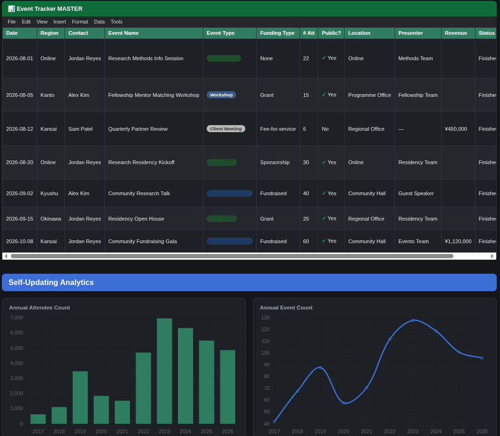

# Team Operational Architecture

An operational system for coordinating research programmes, people, events, tasks, documentation, and recurring workflows.

**[Live interactive demo →](https://team-operational-architecture-8dtngann9npecppulknp8r.streamlit.app/)**
---

# What it does

Tracks events across 4 programme types (Intensive, Fellowship, Events, Residency)
One checkbox syncs a row to internal + public Google Calendars
Cancelling a row removes it from every calendar automatically
Automated reminders: missing attendance, contracts expiring in 60/40 days
Auto-built monthly revenue table feeds the dashboard above

---

# Design principles

### 1. Make normal work easy

People interacting with the system should not need to understand its implementation.

### 2. Make exceptions visible

Missing information and failures should surface rather than disappear.

### 3. Automate repetitive coordination

Repeated reminders, synchronization, status checks, and notifications are good candidates for automation.

### 4. Keep humans responsible for judgement

Automation should support decisions rather than silently make irreversible ones.

### 5. Separate configuration from implementation

Operational changes should not require code changes wherever practical.

### 6. Treat documentation as part of the system

An SOP is more useful when it is connected to the process that requires it.

### 7. Design for maintainability

A small team should be able to understand what the system is doing and change it without needing a large engineering team.

---

# Data and confidentiality

This repository is an independent synthetic reconstruction.
All people, organisations, email addresses, programmes, events, research projects, financial figures, and records are fictional.
